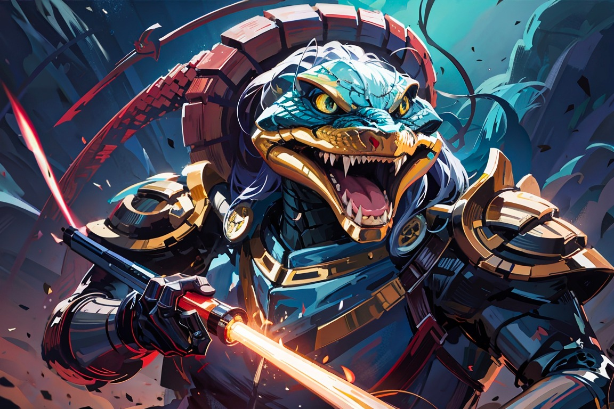

# Battlesnake Server


This project tries to showcase how I would structure a REST API for the Battlesnake game. The project implements the API spec described on the [Battlesnake website](https://docs.battlesnake.com/api). The goal is to make the API production ready, so as an addition to the Battlesnake endpoints, a `/docs` endpoint is added to the project as well.



## Running the server

To run the server, first clone this project. The project uses environment variables to set certain settings, the defaults of those variables are:

```
LISTEN_ADDRESS=:8080
SOLVER=safe # choose a solver, currently implemented: safe, random

# Following variables are used in the root endpoint:
API_VERSION=1
AUTHOR=Sam Kroon
COLOR=#4287f5
HEAD=default
TAIL=default
VERSION=0.0.1
```

#### Run with Go
**using the .env file:**
`go run main.go`

**using environment variables on the command line:**
`LISTEN_ADDRESS=127.0.0.1:8080 go run main.go`

#### Run with Docker
First build the Docker container:
```
docker build -f ./Dockerfile -t battlesnake-server .
```
Then run with: 
```
docker run -p 127.0.0.1:8080:8080/tcp battlesnake-server
```
You can set run the docker container with environment variables using the flags `--env LISTEN_ADDRESS=:8080` or `--env-file ./.env`. Make sure the application listens on `0.0.0.0` and do not use `localhost`/`127.0.0.1` when running the application in a Docker container.

## Project structure

The project exists of two packages:
- `battlesnake`: contains all game specific logic and solver implementations
- `server`: contains the API implementation

In the main.go everything is wired together and started.

#### Solvers
Currently the server only implements two very simple solving algorithms:
- random: selects a next move at random
- safe: checks if there is a move which does not cause a collision, and returns the first one it finds.